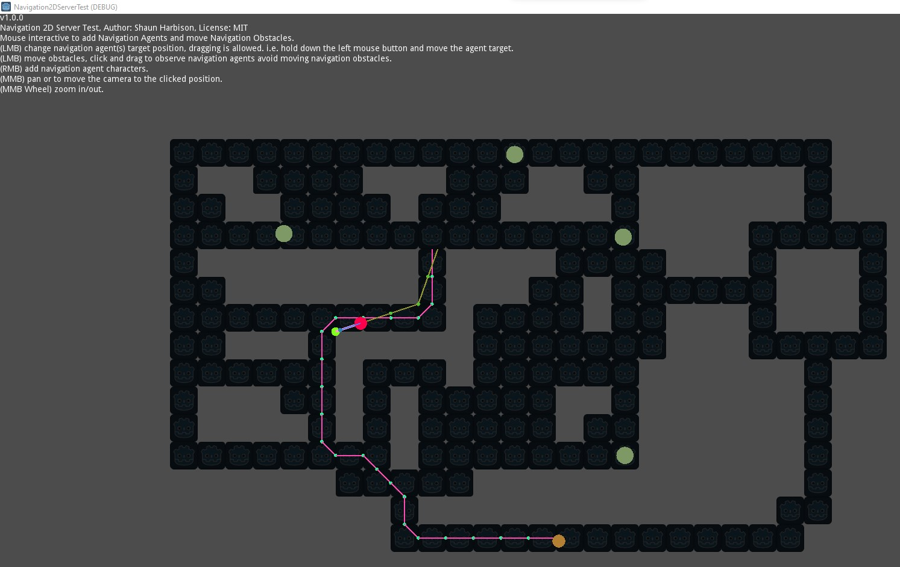
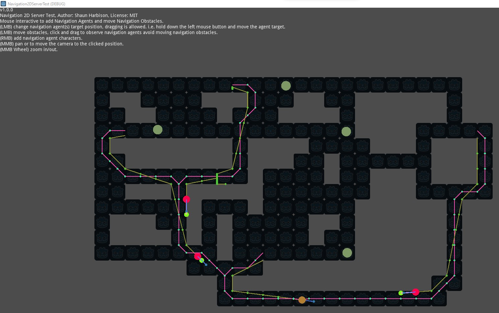

# NavigationServer2DTest
### Godot NavigationServer2D test for Godot Engine 4.0.
#### See 3.5 branch for old demo. https://github.com/sjharb/Navigation2DServerTest/tree/3.5

Godot Asset Library
https://godotengine.org/asset-library/asset/1427

YouTube demonstration
https://youtu.be/WCDA0O8VUIE

#### Basic 2D navigation server demo in Godot Engine 3.5 using the following components
- NavigationServer2D
- NavigationAgent2D
- NavigationObstacle2D

#### Mouse interactive to add Navigation Agents and move Navigation Obstacles
- Left Mouse click to change navigation agent(s) target position, dragging is allowed. i.e. hold down the left mouse button and move the agent target.
- Left Mouse click to move obstacles, click and drag to observe navigation agents avoid moving navigation obstacles.
- Right Mouse click to add navigation agent characters.
- Middle click and hold to pan or to move the camera to the clicked position.
- Middle Scroll up/down to zoom in/out.

#### Note: This is a work in progress and contains bugs as this is the first test I have done with the navigation server, agents and obstacles in Godot Engine 3.5.

#### Known Bugs:
- scene/2d/node_2d.cpp:356 - Condition "!parent_2d" is true. Returned: Transform2D()
- Using NavigationObstacle2d workaround until bug is fixed for NavigationObstacle2D in https://github.com/godotengine/godot/issues/64185

